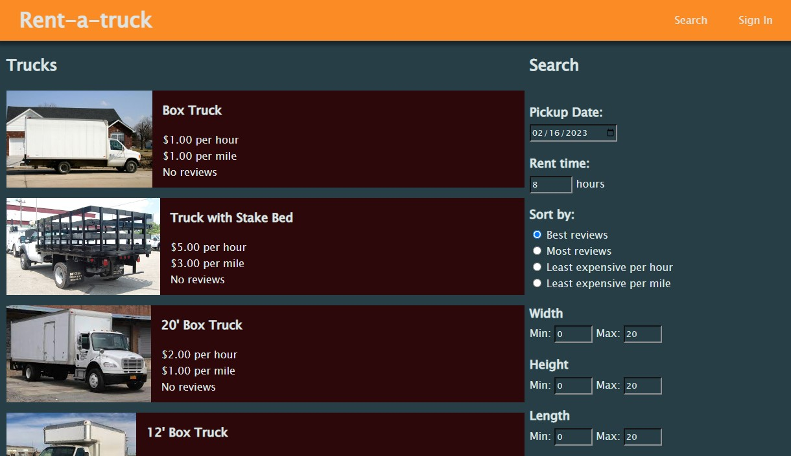

# Rent-A-Truck

## Description

Renting a truck for various projects and needs can be an arduous process. There are few truck rental options, and their websites can be frustrating to use. Rent-a-Truck is an attempt to create a streamlined experience for finding and renting a truck. It can allow users to get a truck that best fits their needs.

This website is a platform to allow users to rent trucks for the purpose of hauling. Trucks can be filtered when searching to find a truck that best fits a user's needs. Those who own trucks can list them for users to find, and the system can track current rents as well as various metrics for the trucks.

## Table of Contents

- [Description](#description)
- [Installation](#installation)
- [Usage](#usage)
- [Credits](#credits)
- [License](#license)

## Installation

After you have cloned the repository by whatever means you prefer, you will need to run several commands and configure the environment variables to finalize the installation.

1. Verify that you have Node and npm installed, then run `npm i` to install all the dependencies.
2. A mysql database is needed to connect to; which can be initialized using [`schema.sql`](./db/schema.sql).
3. Create a `.env` file using [`.env.EXAMPLE`](./.env.EXAMPLE) as a template. You will need to enter your database connection information, as well as any string of characters to act as the session encyption key.
4. Run `npm start` to launch the server.
5. Optionally, you can run `npm run seed` to fill the database with placeholder data.

## Usage

The website is hosted and visitable at [rent-a-truck.herokuapp.com
](https://rent-a-truck.herokuapp.com).

You will need an account to actually do anything with the website, so you can click ["Sign In"](https://rent-a-truck.herokuapp.com/signin) from any page.

After signing in, you can go to the home page to see a list of available trucks. In the search section you can enter filters to find a truck that best fits your needs. Click any truck to see more detailed information about it, including a list of features and reviews. You can choose a rent pickup and duration, then reserve the truck. Later, you can go to ["Your Rentals"](https://rent-a-truck.herokuapp.com/dashboard/renter) to view your outstanding rents. From this page you can pickup or cancel any reservation, and later you can also return the truck. When returning a truck, you can leave a review to help future customers know about your experience with the truck.

If you want to make a truck of your own available to rent, you can go to ["Your Trucks"](https://rent-a-truck.herokuapp.com/dashboard/rental) and click ["Add a New Truck"](https://rent-a-truck.herokuapp.com/truck/new). After posting your truck, it will become available to users for rent. You will be able to view the truck's revenue and history through the "Your Trucks" dashboard.

## Credits

Jackie Lee: [JJackielee](https://github.com/JJackielee)

Jason Arter: [error201](https://github.com/error201)

Kailen James: [SprocketCreations](https://github.com/SprocketCreations)

## License

This project is licenced under [The MIT Licence](LICENSE)

## Features

- Browse through and sort available trucks to rent.
- See information about each truck, including reviews and a list of features.
- Get payment estimations.
- Rent as many trucks as you want.
- Pickup, Cancel, and Return rented trucks.
- Leave reviews on trucks you have rented.
- Put up your own trucks for rent.
- See your truck's rent history.